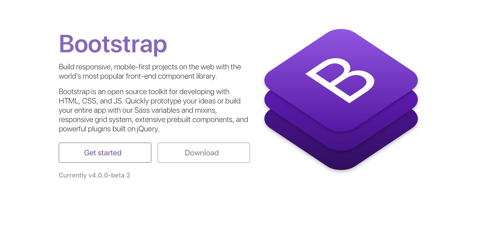
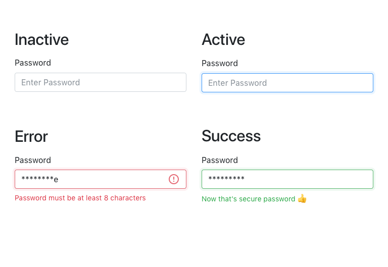
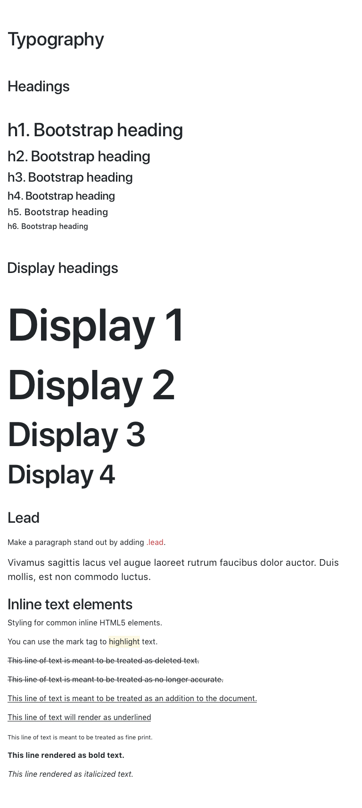
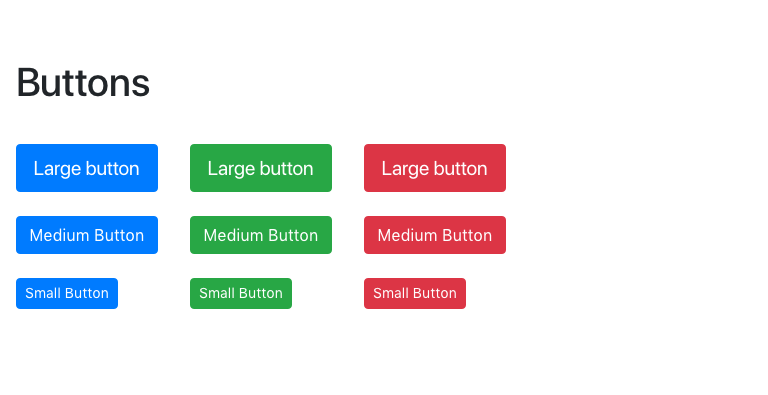

# sketch-ui-library

Learning the UI library from the basics with Sketch and BS4 with SCSS

## Symbols

### Color Palette (bs4/colors/)

### Typography

### Buttons

## Author

@peterblazejewicz
